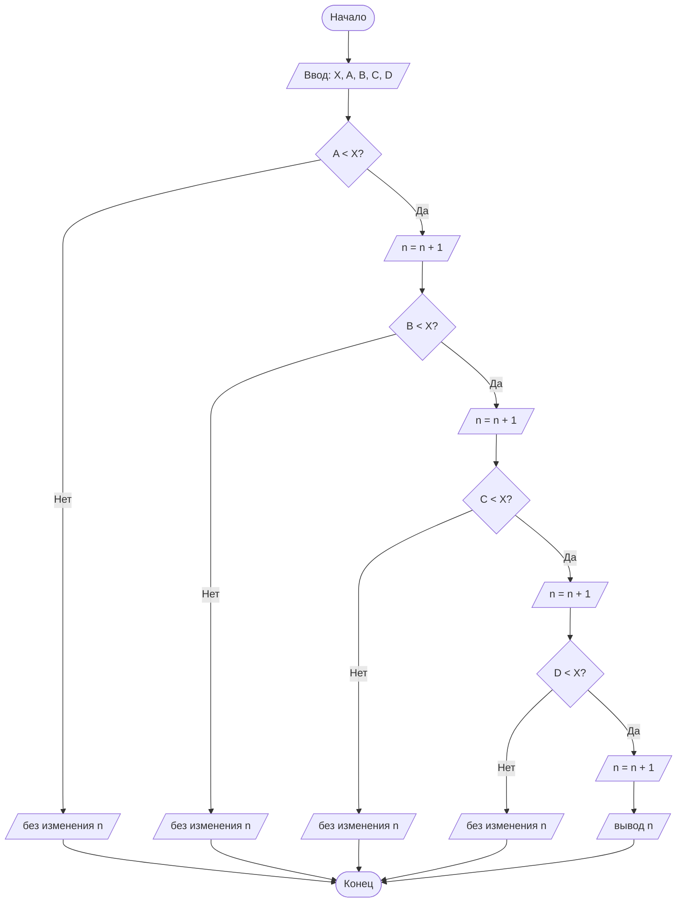

## Отчет по лабораторной работе № 1

#### № группы: `ПМ-2501`

#### Выполнила: `Новикова Полина Андреевна`

#### Вариант: `13`

### Cодержание:

- [Постановка задачи](#1-постановка-задачи)
- [Входные и выходные данные](#2-входные-и-выходные-данные)
- [Выбор структуры данных](#3-выбор-структуры-данных)
- [Алгоритм](#4-алгоритм)
- [Программа](#5-программа)
- [Анализ правильности решения](#6-анализ-правильности-решения)

### 1. Постановка задачи

> Набор бусинок диаметрами A, B, C, D, надетый на нить, пытаются протащить в указанном порядке через отверстие диаметром X. Какое количество
>бусинок удастся протащить через отверстие? На вход программы подаются
>натуральные числа X, A, B, C, D.

Так как каждое из значений A, B, C, D может быть больше X, а может быть меньше либо равняться значению X, сравниваем каждое значение поочередно с X:
1. `A < X`
2. `B < X`
3. `C < X`
4. `D < X`
   
Если значение меньше X(диаметра), то в счетчике n увеличивается на единицу.

`int n = 0;` - задаем счетчику начальное значение нуль.

`n = n + 1;` - если условие выполняется, увеличиваем на единицу.

После того, как мы сравнили каждое значение с диаметром X, выводим значение счетчика, которое показывает количество бусин, которые проходят через диаметр.

### 2. Входные и выходные данные

#### Данные на вход

На вход программа должна получать 5 чисел, при этом они принадлежат множеству натуральных чисел. Минимальное возможное это единица.


#### Данные на вход


|             | Тип                | min значение    | max значение   |
|-------------|--------------------|-----------------|----------------|
| X (Число 1) | Натуральное число | 1 | 2<sup>31</sup>-1 |
| A (Число 2) | Натуральное число | 1 | 2<sup>31</sup>-1 |
| B (Число 2) | Натуральное число | 1 | 2<sup>31</sup>-1 |
| C (Число 2) | Натуральное число | 1 | 2<sup>31</sup>-1 |
| D (Число 2) | Натуральное число | 1 | 2<sup>31</sup>-1 |

#### Данные на выход

Т.к. программа выводит значение счетчика n, которое может равняться и нулю, то n - целое неотрицательное число. Максимальное значение которого может являтся 4, при условии, что все бусины проходят через отверстие.


|         | Тип                                | min значение | max значение   |
|---------|------------------------------------|--------------|----------------|
| n | Целое неотрицательное число | 0            | 4 |


### 3. Выбор структуры данных

Программа получает 5 натуральных чисел, не превышающих 2<sup>31</sup>-1. И одно целое неотрицательное n, которое также принадлежит целочисленному типу данных `int`. Поэтому для их хранения
можно выделить 5 переменных (`X`, `A`, `B`, `C`, `D`) типа `int`. И переменную `n` типа `int`. 

|             | название переменной | Тип (в Java) | 
|-------------|---------------------|--------------|
| X (Число 1) | `X`                 | `int`     |
| A (Число 2) | `A`                 | `int`     | 
| B (Число 2) | `B`                 | `int`     | 
| C (Число 2) | `C`                 | `int`     |
| D (Число 2) | `D`                 | `int`     | 

### 4. Алгоритм

#### Алгоритм выполнения программы:

1. **Ввод данных:**  
   Программа считывает 5 натуральных чисел, обозначенные как `X`, `A`, `B`, `C`, `D`. Так же объявляется и инициализируется переменная `n`.

2. **Сравнение чисел:**  
   Программа сравнивает значение `X` с `A`, `B`, `C`, `D` поочередно. Если `A` меньше `X`, значение счетчика `n` увеличивается на единицу и программа переходит к следующему шагу для сравнения `B`, `C`, `D` c `X`.  Если `A` больше или равно `X`, значение счетчика `n`  не меняется, и следующие бусины уже не проверяются программой.

3. **Вывод результата:**  
   На экран выводится значение счетчика `n`.

#### Блок-схема


### 5. Программа
```java
import java.io.PrintStream;
import java.util.Scanner;

public class Main {
    public static Scanner in = new Scanner(System.in);
    public static PrintStream out = System.out;

    public static void main(String[] args) {
        // подаем на вход диаметр отверстия и диаметры бусин
        int X = in.nextInt();
        int A = in.nextInt();
        int B = in.nextInt();
        int C = in.nextInt();
        int D = in.nextInt();
        int n = 0;
        if (A < X) {
            n++;
            if (B < X) {
                n++;
                if (C < X) {
                    n++;
                    if (D < X) {
                        n++;
                    }
                }
            }

        } else {

        }

        System.out.println(n);
    }
}
```
### 6. Анализ правильности решения

Программа работает корректно на всем множестве решений с учетом ограничений.

1. Все бусины меньше 'X'. Тест на 'X = 10':

    - **Input**:
        ```
        1 2 3 4
        ```

    - **Output**:
        ```
        4
        ```

2. Все бусины равны 'X'. Тест на `X = 5`:

    - **Input**:
        ```
        5 5 5 5
        ```

    - **Output**:
        ```
        0
        ```

3. Все бусины больше 'X'. Тест на `X = 10`:

    - **Input**:
        ```
        11 12 14 18
        ```

    - **Output**:
        ```
        0
        ```

4. Cначала бусины меньше, потом больше. Тест на `X = 8`:

    - **Input**:
        ```
        3 7 9 10
        ```

    - **Output**:
        ```
        2
        ```
5. Cначала бусины больше, потом меньше. Тест на `X = 4`:

    - **Input**:
        ```
        5 6 2 3
        ```

    - **Output**:
        ```
        0
        ```

6. Только D меньше X. Тест на `X = 4`:

    - **Input**:
        ```
        5 6 8 3
        ```

    - **Output**:
        ```
        0
        ```
7. Только 'A' больше 'X'. Тест на `X = 4`:

    - **Input**:
        ```
        5 1 2 3
        ```

    - **Output**:
        ```
        0
        ```


